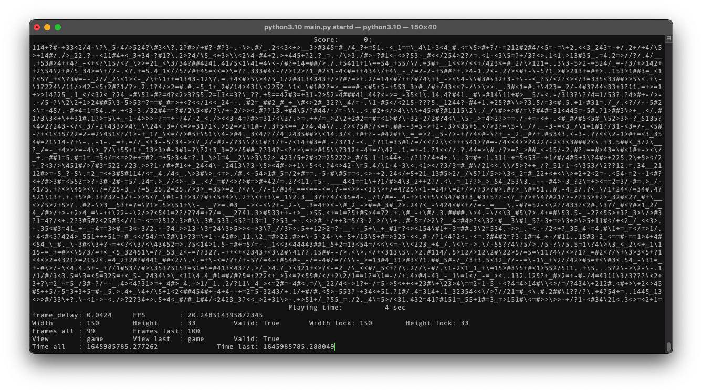

# CLI Snake on Python
<p align="center">
    
    
    
    <br/>
    
</p>

## О проекте

* #### Я решил отвлечься от основной работы и отдохнуть, ~~мой отдых будет заключаться в создании змейки~~)

* ### Пока что проект не готов


* Из змейки получилось ядро...
* В общем, теперь это `Python CLI Game Engine`
* И в качетве примера будет как раз змейка.

## Необходимые веши

1. Система UNIX: MacOS, Linux, и тому подобное
2. Python3.10 и выше
3. Библиотеки: `pynput`, `click`

## Как запустить:

* #### Debian based:
```shell
# Shell:

$ sudo apt install git
    # * Installing git VSC... *
$ python3.10 -m pip install -U pip
    # * Update pip... *
$ git clone https://github.com/SantaSpeen/CLI-Snake-on-Python.git
    # * Dowloading... *
$ cd CLI-Snake-on-Python/src/
    # Change dir
$ python3.10 -m pip install -r requirements.txt
    # * Installing requirements... *
$ python3.10 main.py start
    # * Play now! *
```

* #### MacOS:

```shell
# Shell:

$ brew install git
    # * Installing git VSC... *
$ python3.10 -m pip install -U pip
    # * Update pip... *
$ git clone https://github.com/SantaSpeen/CLI-Snake-on-Python.git
    # * Dowloading... *
$ cd CLI-Snake-on-Python/src/
    # Change dir
$ python3.10 -m pip install -r requirements.txt
    # * Installing requirements... *
$ python3.10 main.py start
    # * Нужно разрешить считывание клавиш отовсюду в настройках! *
    # * Разрешаем и запускаем вновь * 
```

## Ссылки

* [Мой Telegram](https://t.me/SantaSpeen "SantaSpeen"): https://t.me/SantaSpeen

Используемые библиотеки: 

* [pynput](https://github.com/moses-palmer/pynput "pynput")
* [click](https://click.palletsprojects.com/ "click")
